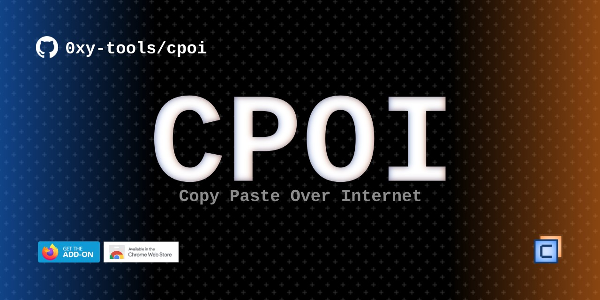
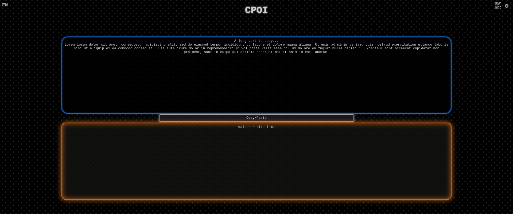
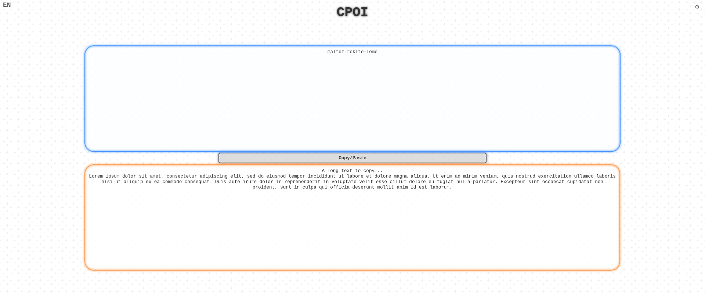

---
# CPOI ? What is it ?
CPOI is a tool that allows you to copy and paste text between your different devices using web browser/extension and cli. Simple and fast to use, no sign-up or account is required.

## How to use it ?

You can simply go to [https://cpoi.magictintin.fr](https://cpoi.magictintin.fr) and start copying your text.

- Enter your text to copy in the **blue** area.
- Click <kbd>Copy/Paste</kbd> button

- Enter the code given in the **orange** area in your other device!

> [!NOTE]
> You can use the QRCode icon  to simply copy it on your smartphone by scanning a QRCode.
> 

### Submodules

> [!NOTE]
> To clone the submodules you can 
> - clone only the independant repos
> - get the whole CPOI repo with all its submodules using:
>   - **`git clone --recursive https://github.com/MagicTINTIN/cpoi`**
>   - `git clone https://github.com/MagicTINTIN/cpoi && git submodule update --init`.

### Web browser extension (submodule)
\
Available on Firefox and Chromium-based web browsers!\

\
You can directly clone the [cpoi-extension repo](https://github.com/MagicTINTIN/cpoi-extension).

### Client (submodule)

There is a command line interface to simply use it from a terminal [cpoi-cli](https://github.com/MagicTINTIN/cpoi-cli). If you only want the CLI, you can clone the [cpoi-cli repo](https://github.com/MagicTINTIN/cpoi-cli).

## Create your own server

You will be able to get the server code here (php/sql) in order to create your own instance.

---
# Available requests
All the resquests available are using GET method.
For instance if you clone this repo on your web server __yourserver.xyz__, requests will look like *`https://yourserver.xyz/cpoi`***`?type=value`**

### ?c - Copy
`?c=ValueToCopy` will save your "ValueToCopy" in a clipboard for 30 minutes maximum. It will return you a clipboard code formated like `word-word-word` that you'll need to paste the clipboard onto your other machine.

### ?uc - Unique Copy
`?uc=ValueToCopy`. Same as **?c** (Copy), but clipboard will automaticaly be destroyed once it has been pasted.

### ?p - Paste
`?p=clip-board-code` will display the content of the "clip-board-code"'s clipboard.\
__Note:__ if the clipboard has been created with **?uc**, it will be instantly destroyed, and you won't be able to paste it again.

### ?d - Destroy clipboard
`?d=clip-board-code`. Will destroy the clipboard manually. It won't be possible to paste it anymore.

> **Advanced requests**

### ?d - Aggregate clipboard
`?a=clip-board-code:MoreContent`. Once you created a clipboard (with **?c** or **?uc**), you can aggregate it with more values. For instance, if your clipboard contained "Content" it will now contain "ContentMoreContent".